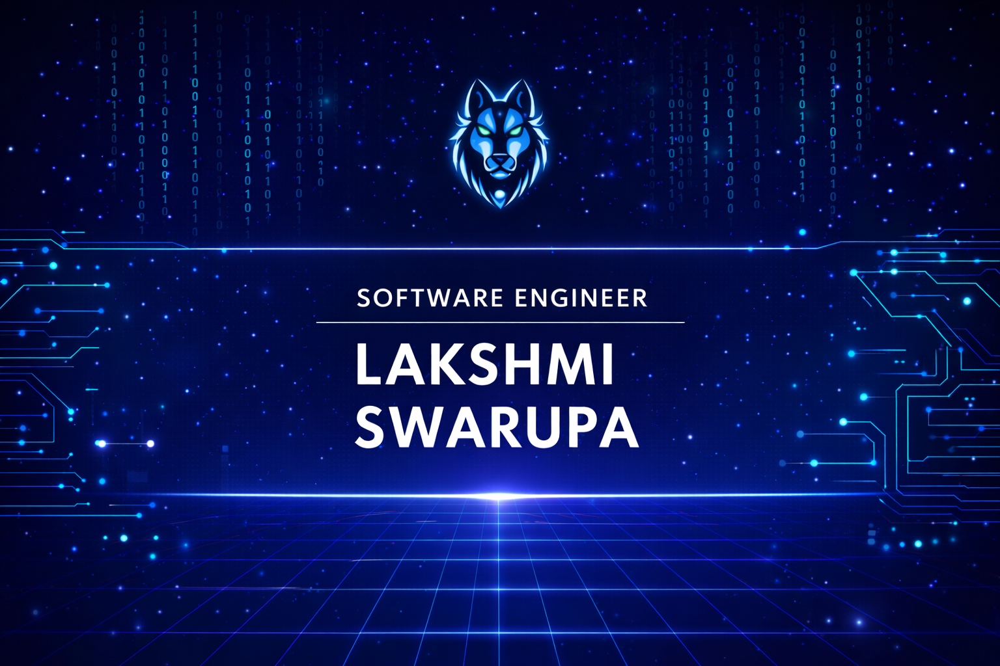

<h1 align="center">Hi 👋, I'm Lakshmi Swarupa</h1>
<h3 align="center">Salesforce Developer ☁️ | DevOps Learner 🔧</h3>

  

---

### 👩‍💻 About Me

- 💼 Currently working as a Salesforce Developer at Capgemini
- 🚀 Upskilling in DevOps, Linux, CI/CD, and cloud technologies
- 📝 I write and share learning notes & cheatsheets on Salesforce and DevOps concepts (blogs coming soon on Hashnode 🚀)
- 👨‍💻 Explore my projects at GitHub: https://github.com/swarupa22

## ☁️ Salesforce Expertise

<strong>🛠️ Administration</strong> 
👥 Users & Access &nbsp;•&nbsp;
🔐 Security & Data &nbsp;•&nbsp;
🔄 Flows & Automation &nbsp;•&nbsp;
📊 Reports

<strong>⚙️ Development</strong> 
🧩 Apex & Triggers &nbsp;•&nbsp;
🔍 SOQL / SOSL &nbsp;•&nbsp;
⚡ LWC &nbsp;•&nbsp;
⏱️ Async Apex &nbsp;•&nbsp;
🔗 Integrations

## 💻 Programming Languages

  
  
  
  
  
  
  

## 🛠️ Tools & Technologies

  <!-- Salesforce & Cloud -->
  
  

  <!-- Version Control & CI/CD -->
  
  
  

  <!-- DevOps & OS -->
  

  <!-- Dev Tools -->
  
  
  
  

## 🤝 Soft Skills

🧠 Problem Solving &nbsp;•&nbsp; 💬 Communication &nbsp;•&nbsp; ⏳ Time Management &nbsp;•&nbsp; 📚 Self-Learning

## 🌐 Connect With Me

  <a href="mailto:munagalalakshmiswarupa23@gmail.com">📧 Email</a> &nbsp;|&nbsp;
  <a href="https://linkedin.com/in/lakshmiswarupa25" target="_blank">💼 LinkedIn</a> &nbsp;|&nbsp;
  <a href="https://hashnode.com/@swarudevopsjourney" target="_blank">✍️ Hashnode</a>

## 📊 GitHub Stats

  

⚡ **Fun fact:** Debugging feels like solving puzzles to me 🧩
